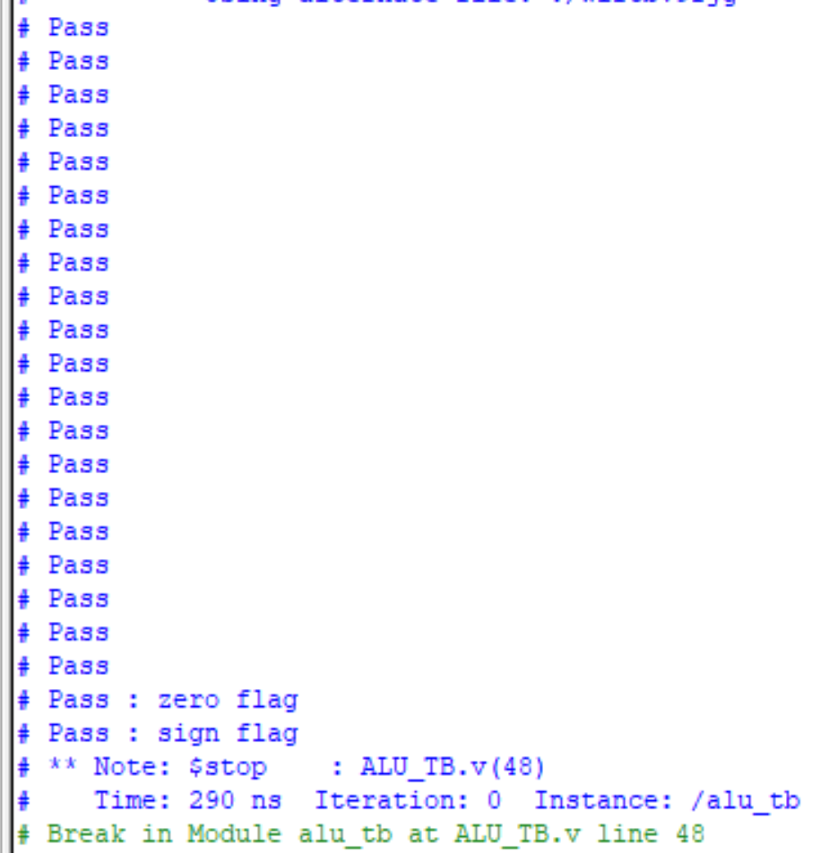
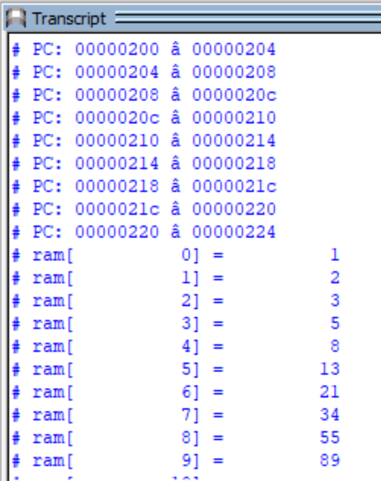
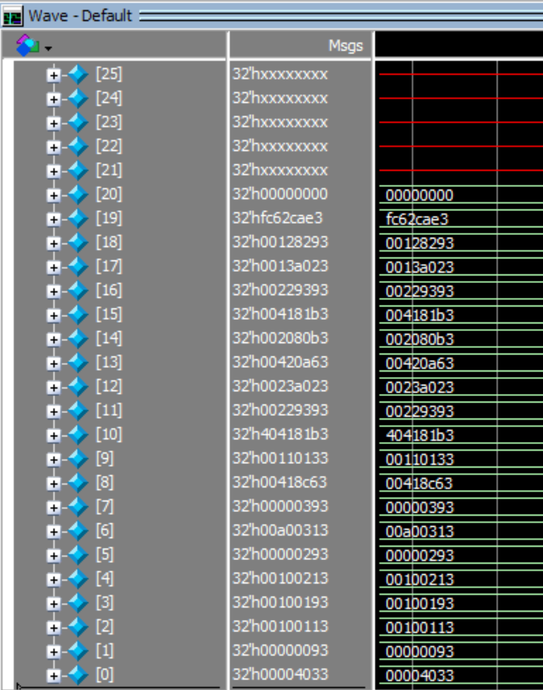
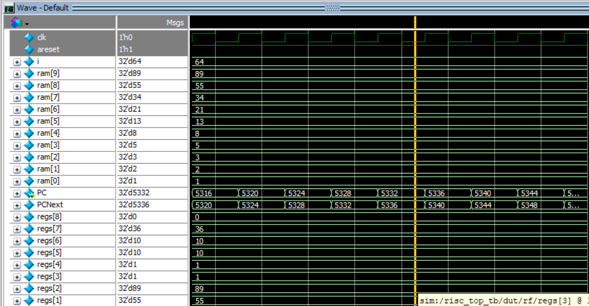
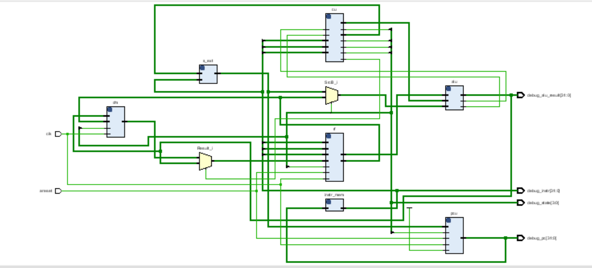
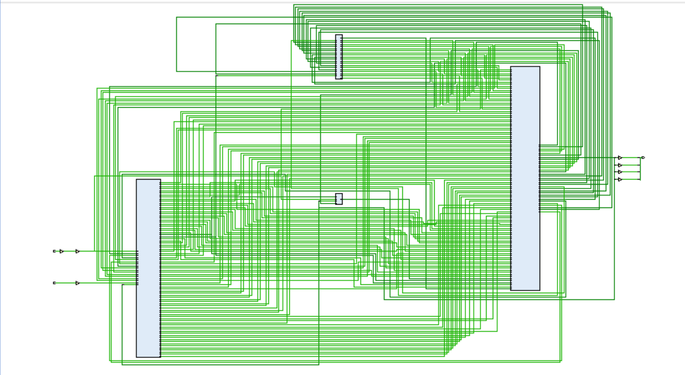
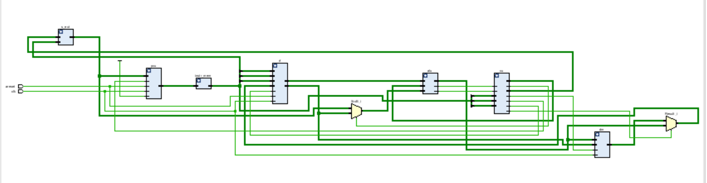
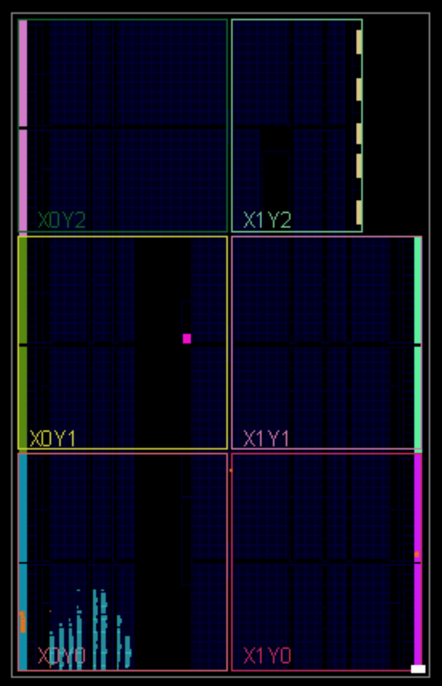

# 🧠 RISC-V RV32I Single-Cycle Processor  

This project implements a *single-cycle processor* based on the *RISC-V RV32I* instruction set. The design is written in *Verilog HDL*, tested with **QuestaSim**, synthesized and implemented using **Vivado**, and finally deployed to an **FPGA board**.  

---

## 📚 Table of Contents  

- [Project Features](#-project-features)  
- [Folder Structure](#-folder-structure)
- [Testbench and Simulation](#-testbench-and-simulation)
- [Fibonacci Program Execution](#-fibonacci-program-execution)
- [FPGA Synthesis & Implementation](#-fpga-synthesis--implementation)
- [FPGA Deployment](#-fpga-deployment)
- [Tools Used](#-tools-used)
- [How to Run](#-how-to-run)
- [Author](#-author)
- [Notes](#-notes)

---

## 📌 Project Features

- ✅ Supports base *RV32I* instruction set (32-bit)  
- ✅ Fully modular design: ALU, Control Unit, Register File, Memories  
- ✅ *Single-cycle architecture* (each instruction executes in one clock cycle)  
- ✅ Successfully *runs a Fibonacci program* and stores results in RAM  
- ✅ Tested via *testbenches and simulation*  
- ✅ Deployed on *FPGA* and verified in hardware  

---

## 📁 Folder Structure  

| Folder                 | Description                                                         |
|------------------------|---------------------------------------------------------------------|
| RTL/                 | Verilog HDL files (ALU, Control Unit, etc.)                         |
| TB/                  | Testbench files for simulation                                      |
| Simulation/          | .do files and simulation scripts for QuestaSim                    |
| FPGA_Implementation/ | Vivado project files and constraint files                           |
| Docs/                | Screenshots, schematics, and simulation outputs                     |  

---

## 🧪 Testbench and Simulation  

Two testbenches were created:  

- top_tb.v: Verifies full processor functionality (with Fibonacci program)  
- alu_tb.v: Tests the ALU module separately  

### ✅ ALU Testbench Output  
  

### ✅ Top Testbench Output  
  

---

## 💾 Fibonacci Program Execution  

The processor was loaded with a Fibonacci program using an instruction memory file program.txt. After simulation, the resulting Fibonacci sequence appears in RAM.  

### 📥 Instruction Memory  
  

### 📤 RAM Output (Fibonacci)  
  

---

## 🧩 FPGA Synthesis & Implementation  

Synthesis and implementation were performed successfully using *Vivado*.  

### ✅ Synthesis Success  
  

### ✅ Implemented Design  
  

### 🧠 Schematic View  
  

---

## 🚀 FPGA Deployment  

The processor was programmed onto an FPGA board and verified to run correctly.  

  

---

## 🛠 Tools Used  

- *Verilog HDL*  
- *QuestaSim* for simulation  
- *Vivado* for synthesis and implementation  
- *Target FPGA*:  
  - *Board*: Basys 3  
  - *FPGA Chip*: Xilinx Artix-7 (XC7A35T-1LCPG236)  

---

## 📥 How to Run 

### 🔬 Simulation:  
1. Open **QuestaSim**  
2. Navigato to the `transcript` 
3. Run using .do file: write `do top.do` to compile and simulate 

### 💡 FPGA:  
1. Open **Vivado Project** `FPGA_Implementation/RISC_V.xpr`  
2. Synthesize, implement, and generate bitstream  
3. Program your FPGA board and observe results  

--- 

## 👨‍💻 Author 

**Kareem Ashraf**  
Electronics and Communications Engineering, Cairo University   
📧 **Email**   : [kareem.ash05@gmail.com]   
🔗 **Linkedin** : [www.linkedin.com/in/kareem-ashraf-9aba48348]
🔗 **GitHub**   : [https://github.com/kareem05-ash]  

---   

## 📌 Notes  

- This project was part of our **Self-learning Journey** 
- It will be continously updated to exlore pipelined and multi-cycle implementations in the future. 